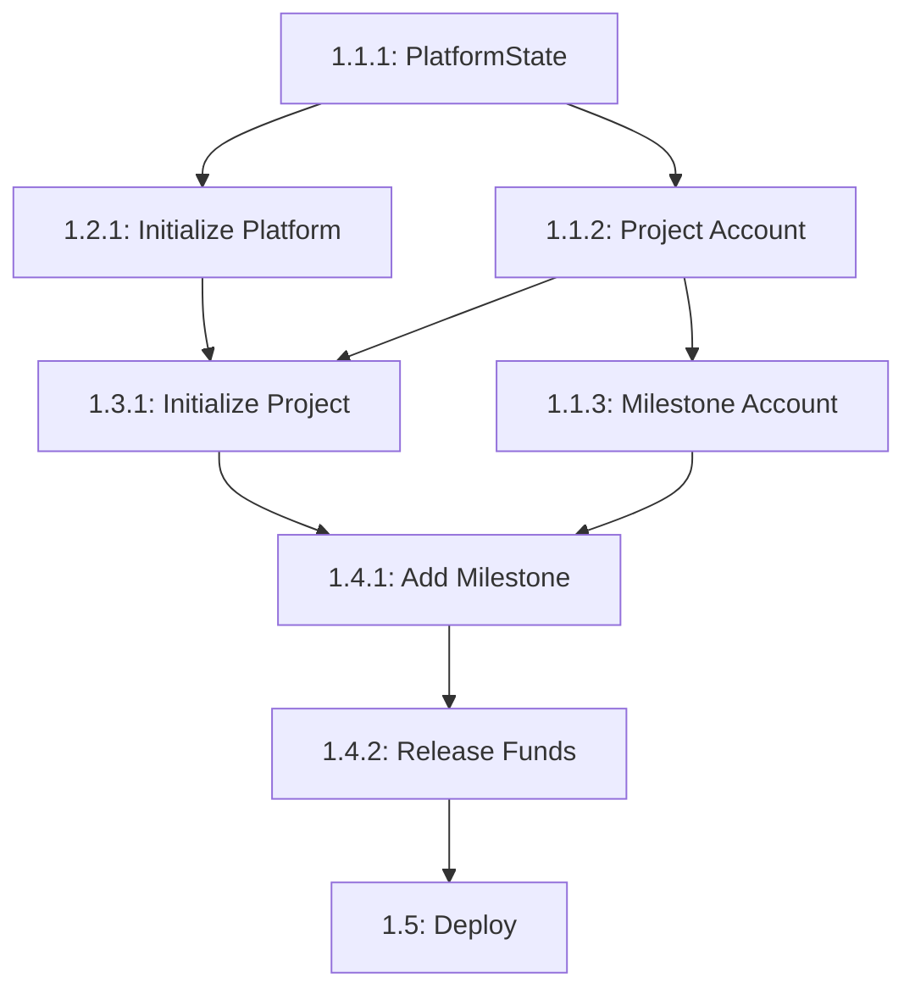

# EXECUTION PLAN: Epic 1 - Blockchain Infrastructure

**Epic ID:** EPIC-01
**Last Updated:** 2025-10-26
**Overall Status:** 🔴 Not Started
**Completion:** 0% (0/15 tasks completed)

---

## Epic Progress Dashboard

| Story | Status | Progress | Tasks Completed | Estimated | Actual | Blocker |
|-------|--------|----------|-----------------|-----------|--------|---------|
| 1.1: Define Accounts | 🔴 Not Started | 0% | 0/3 | 2h | - | - |
| 1.2: Platform Init | 🔴 Not Started | 0% | 0/3 | 1h | - | - |
| 1.3: Project Creation | 🔴 Not Started | 0% | 0/3 | 2h | - | - |
| 1.4: Milestone Mgmt | 🔴 Not Started | 0% | 0/3 | 2h | - | - |
| 1.5: Deploy & Validate | 🔴 Not Started | 0% | 0/3 | 1h | - | - |
| **TOTAL** | 🔴 | **0%** | **0/15** | **8h** | **-** | - |

**Status Legend:**
- 🔴 Not Started
- 🟡 In Progress
- 🟢 Completed
- 🔵 Blocked
- ⚠️ At Risk

---

## Story 1.1: Define On-Chain Account Structures

**Story Status:** 🔴 Not Started
**Progress:** 0% (0/3 tasks)
**Target Completion:** Day 1, Hour 2

### Task Tracker

| Task ID | Task Name | Status | Assignee | Est | Actual | Dependencies | Notes |
|---------|-----------|--------|----------|-----|--------|--------------|-------|
| 1.1.1 | Create PlatformState struct | 🔴 | RECTOR | 30m | - | None | Start here |
| 1.1.2 | Define Project account | 🔴 | RECTOR | 45m | - | 1.1.1 | Align with DB schema |
| 1.1.3 | Define Milestone account | 🔴 | RECTOR | 45m | - | 1.1.1 | PDA seeds critical |

### Task Details

#### ✅ **Task 1.1.1: Create PlatformState struct**
- **File:** `solana-program/openbudget/programs/openbudget/src/state.rs`
- **Validation Checklist:**
  - [ ] File created with proper Anchor imports
  - [ ] PlatformState struct with `admin: Pubkey` and `project_count: u64`
  - [ ] `impl PlatformState` with `const LEN: usize = 48`
  - [ ] Compiles without errors: `anchor build`
- **Blockers:** None
- **Notes:** This is the foundation - other accounts depend on this file structure

---

#### ✅ **Task 1.1.2: Define Project account**
- **File:** Same `state.rs`
- **Validation Checklist:**
  - [ ] Project struct added with 8 fields (id, title, ministry, budgets, counts, timestamp, authority)
  - [ ] String field sizes match PRD spec (id=32, title=100, ministry=50)
  - [ ] `const LEN: usize = 259` calculated correctly
  - [ ] Cross-reference with `database/schema.sql` for field alignment
- **Blockers:** None
- **Dependencies:** 1.1.1 must be done first (same file)
- **Notes:** Double-check space calculation - rent failures are hard to debug

---

#### ✅ **Task 1.1.3: Define Milestone account**
- **File:** Same `state.rs`
- **Validation Checklist:**
  - [ ] Milestone struct with 7 fields including `Option<i64>` for released_at
  - [ ] `const LEN: usize = 471`
  - [ ] PDA seed pattern documented: `[b"milestone", project_id.as_bytes(), &[index]]`
  - [ ] Build succeeds: `anchor build`
- **Blockers:** None
- **Notes:** The `Option<i64>` adds 1 byte for the enum discriminator

---

### Story 1.1 Completion Criteria
- [ ] All 3 structs defined in `state.rs`
- [ ] Space calculations verified (no warnings from Anchor)
- [ ] PDA seed patterns documented in code comments
- [ ] `anchor build` succeeds

---

## Story 1.2: Implement Platform Initialization

**Story Status:** 🔴 Not Started
**Progress:** 0% (0/3 tasks)
**Target Completion:** Day 1, Hour 3

### Task Tracker

| Task ID | Task Name | Status | Assignee | Est | Actual | Dependencies | Notes |
|---------|-----------|--------|----------|-----|--------|--------------|-------|
| 1.2.1 | Create initialize_platform instruction | 🔴 | RECTOR | 20m | - | 1.1.1 | New file |
| 1.2.2 | Wire into lib.rs | 🔴 | RECTOR | 10m | - | 1.2.1 | Module setup |
| 1.2.3 | Write initialization tests | 🔴 | RECTOR | 30m | - | 1.2.2 | Happy + error cases |

### Task Details

#### ✅ **Task 1.2.1: Create initialize_platform instruction**
- **File:** `solana-program/openbudget/programs/openbudget/src/instructions/initialize_platform.rs` (NEW)
- **Validation Checklist:**
  - [ ] Create `instructions/` directory
  - [ ] File created with `InitializePlatform` accounts struct
  - [ ] `handler()` function implemented (sets admin, project_count = 0)
  - [ ] Uses `#[account(init)]` constraint with PDA seeds `[b"platform"]`
  - [ ] `msg!()` log statement included
- **Blockers:** None
- **Notes:** This is a one-time setup instruction - add constraint to prevent re-init

---

#### ✅ **Task 1.2.2: Wire into lib.rs**
- **File:** `solana-program/openbudget/programs/openbudget/src/lib.rs`
- **Validation Checklist:**
  - [ ] Add `pub mod instructions;` at top
  - [ ] Create `instructions/mod.rs` with `pub mod initialize_platform;`
  - [ ] Add `initialize_platform()` function to `#[program]` block
  - [ ] Compiles: `anchor build`
- **Blockers:** None
- **Notes:** Use `use instructions::*;` pattern for cleaner code

---

#### ✅ **Task 1.2.3: Write initialization tests**
- **File:** `solana-program/openbudget/tests/openbudget.ts`
- **Validation Checklist:**
  - [ ] Test: "Initializes platform state" - verifies admin and project_count
  - [ ] Test: "Fails to re-initialize" - expects error on duplicate init
  - [ ] Both tests pass: `anchor test`
  - [ ] PDA derivation matches Rust seeds exactly
- **Blockers:** Need devnet SOL (airdrop if needed)
- **Notes:** Run `solana airdrop 2` if wallet balance low

---

### Story 1.2 Completion Criteria
- [ ] Instruction implemented and wired up
- [ ] 2 tests passing (happy path + error case)
- [ ] `anchor test` completes successfully

---

## Story 1.3: Implement Project Creation

**Story Status:** 🔴 Not Started
**Progress:** 0% (0/3 tasks)
**Target Completion:** Day 1, Hour 5

### Task Tracker

| Task ID | Task Name | Status | Assignee | Est | Actual | Dependencies | Notes |
|---------|-----------|--------|----------|-----|--------|--------------|-------|
| 1.3.1 | Create initialize_project instruction | 🔴 | RECTOR | 45m | - | 1.1.2, 1.2.2 | Complex validation |
| 1.3.2 | Define error codes | 🔴 | RECTOR | 15m | - | None | In lib.rs |
| 1.3.3 | Write project creation tests | 🔴 | RECTOR | 60m | - | 1.3.1, 1.3.2 | 3+ test cases |

### Task Details

#### ✅ **Task 1.3.1: Create initialize_project instruction**
- **File:** `solana-program/openbudget/programs/openbudget/src/instructions/initialize_project.rs` (NEW)
- **Validation Checklist:**
  - [ ] `InitializeProject` accounts struct with Project, PlatformState, authority
  - [ ] PDA seeds: `[b"project", project_id.as_bytes()]`
  - [ ] Input validation: project_id len, title len, budget > 0
  - [ ] Platform project_count incremented atomically
  - [ ] Authority stored in project.authority field
  - [ ] Timestamp captured via `Clock::get()?`
- **Blockers:** None
- **Notes:** Use `require!()` macros for clean validation logic

---

#### ✅ **Task 1.3.2: Define error codes**
- **File:** `solana-program/openbudget/programs/openbudget/src/lib.rs`
- **Validation Checklist:**
  - [ ] `#[error_code] pub enum ErrorCode` added
  - [ ] Errors: ProjectIdTooLong, InvalidTitle, InvalidBudget, InsufficientBudget, UnauthorizedAccess, MilestoneAlreadyReleased
  - [ ] Each error has `#[msg("...")]` with clear description
- **Blockers:** None
- **Notes:** Add all errors now to avoid rebuild churn later

---

#### ✅ **Task 1.3.3: Write project creation tests**
- **File:** `solana-program/openbudget/tests/openbudget.ts`
- **Validation Checklist:**
  - [ ] Test: "Creates a project successfully" - verifies all fields
  - [ ] Test: "Prevents duplicate project IDs" - expects error
  - [ ] Test: "Validates input constraints" - empty title, zero budget, long ID
  - [ ] Platform project_count incremented correctly
- **Blockers:** Depends on error codes being defined
- **Notes:** Use descriptive project IDs (e.g., "KEMENKES-2025-001")

---

### Story 1.3 Completion Criteria
- [ ] Instruction handles all validation cases
- [ ] 3+ tests passing
- [ ] Platform state updates correctly

---

## Story 1.4: Implement Milestone Management

**Story Status:** 🔴 Not Started
**Progress:** 0% (0/3 tasks)
**Target Completion:** Day 1, Hour 7

### Task Tracker

| Task ID | Task Name | Status | Assignee | Est | Actual | Dependencies | Notes |
|---------|-----------|--------|----------|-----|--------|--------------|-------|
| 1.4.1 | Implement add_milestone | 🔴 | RECTOR | 45m | - | 1.1.3, 1.3.1 | Budget validation critical |
| 1.4.2 | Implement release_funds | 🔴 | RECTOR | 30m | - | 1.4.1 | One-way operation |
| 1.4.3 | Write comprehensive tests | 🔴 | RECTOR | 45m | - | 1.4.1, 1.4.2 | 5+ test cases |

### Task Details

#### ✅ **Task 1.4.1: Implement add_milestone**
- **File:** `solana-program/openbudget/programs/openbudget/src/instructions/add_milestone.rs` (NEW)
- **Validation Checklist:**
  - [ ] `AddMilestone` accounts struct with Milestone, Project, authority
  - [ ] PDA seeds: `[b"milestone", project_id.as_bytes(), &[index]]`
  - [ ] Validates new total doesn't exceed project.total_budget
  - [ ] Authority constraint: `project.authority == authority.key()`
  - [ ] Project milestone_count incremented
  - [ ] Initial state: is_released = false, released_at = None
- **Blockers:** None
- **Notes:** Use `checked_add()` for safe arithmetic

---

#### ✅ **Task 1.4.2: Implement release_funds**
- **File:** `solana-program/openbudget/programs/openbudget/src/instructions/release_funds.rs` (NEW)
- **Validation Checklist:**
  - [ ] `ReleaseFunds` accounts struct
  - [ ] Constraint: `!milestone.is_released` (prevent double-release)
  - [ ] Sets is_released = true, released_at = Some(timestamp)
  - [ ] Updates project.total_released
  - [ ] Stores proof_url parameter
- **Blockers:** None
- **Notes:** This is irreversible - emphasize in code comments

---

#### ✅ **Task 1.4.3: Write comprehensive tests**
- **File:** `solana-program/openbudget/tests/openbudget.ts`
- **Validation Checklist:**
  - [ ] Test: "Adds milestone to project"
  - [ ] Test: "Prevents exceeding budget"
  - [ ] Test: "Releases milestone funds"
  - [ ] Test: "Prevents double-release"
  - [ ] Test: "Enforces authority check"
  - [ ] All edge cases covered
- **Blockers:** None
- **Notes:** Test with multiple milestones per project

---

### Story 1.4 Completion Criteria
- [ ] Both instructions implemented with validation
- [ ] 5+ tests passing (happy + error cases)
- [ ] Project and Milestone state updates correct

---

## Story 1.5: Deploy and Validate

**Story Status:** 🔴 Not Started
**Progress:** 0% (0/3 tasks)
**Target Completion:** Day 1, Hour 8

### Task Tracker

| Task ID | Task Name | Status | Assignee | Est | Actual | Dependencies | Notes |
|---------|-----------|--------|----------|-----|--------|--------------|-------|
| 1.5.1 | Deploy to devnet | 🔴 | RECTOR | 15m | - | All above | Save Program ID |
| 1.5.2 | Sync Program ID (3 locations) | 🔴 | RECTOR | 15m | - | 1.5.1 | Critical step |
| 1.5.3 | Run full test suite | 🔴 | RECTOR | 30m | - | 1.5.2 | Verify on-chain |

### Task Details

#### ✅ **Task 1.5.1: Deploy to devnet**
- **Commands:**
  ```bash
  cd solana-program/openbudget
  anchor build
  anchor deploy --provider.cluster devnet
  ```
- **Validation Checklist:**
  - [ ] Deployment succeeds (no errors)
  - [ ] Program ID copied from output
  - [ ] Solana Explorer link verified: https://explorer.solana.com/address/{PROGRAM_ID}?cluster=devnet
- **Blockers:** Insufficient SOL (airdrop if needed)
- **Notes:** Keep terminal output - contains Program ID

---

#### ✅ **Task 1.5.2: Sync Program ID**
- **Files to Update:**
  1. `solana-program/openbudget/Anchor.toml` → `[programs.devnet] openbudget = "..."`
  2. `solana-program/openbudget/programs/openbudget/src/lib.rs` → `declare_id!("...")`
  3. `frontend/.env.local` → `NEXT_PUBLIC_SOLANA_PROGRAM_ID=...`

- **Post-Update Commands:**
  ```bash
  anchor build
  anchor deploy --provider.cluster devnet
  ```

- **Validation Checklist:**
  - [ ] All 3 files updated with identical Program ID
  - [ ] Rebuild and redeploy successful
  - [ ] Git commit with message: "chore: update Program ID after devnet deployment"
- **Blockers:** None
- **Notes:** **CRITICAL** - mismatch causes transaction failures

---

#### ✅ **Task 1.5.3: Run full test suite**
- **Commands:**
  ```bash
  anchor test --skip-local-validator  # Uses devnet
  ```
- **Validation Checklist:**
  - [ ] All 15+ tests pass
  - [ ] View transactions in Solana Explorer
  - [ ] Verify PDA accounts created correctly
  - [ ] Check program logs for msg!() outputs
- **Blockers:** Program ID sync issues
- **Notes:** If tests fail, verify Program ID in all 3 locations

---

### Story 1.5 Completion Criteria
- [ ] Program deployed to devnet
- [ ] Program ID synchronized across codebase
- [ ] All tests pass on deployed program
- [ ] Explorer links verified

---

## Critical Path & Dependencies



**Critical Path (longest sequence):**
1.1.1 → 1.1.2 → 1.3.1 → 1.4.1 → 1.4.2 → 1.5 = **~6 hours**

**Parallel Opportunities:**
- Tasks 1.1.1, 1.1.2, 1.1.3 can be done in one session (same file)
- Tests (1.2.3, 1.3.3, 1.4.3) can be written while instructions compile

---

## Risk Register & Mitigation

| Risk ID | Description | Impact | Probability | Mitigation | Owner |
|---------|-------------|--------|-------------|------------|-------|
| R1 | Program ID mismatch after deploy | 🔴 High | Medium | Automated verification script | RECTOR |
| R2 | PDA seed pattern mismatch (Rust ↔ TS) | 🔴 High | Low | Document seeds clearly, unit test | RECTOR |
| R3 | Insufficient account space (rent fail) | 🟡 Medium | Low | Add 10% buffer to LEN calculations | RECTOR |
| R4 | Devnet RPC rate limits during testing | 🟢 Low | Medium | Use local validator for rapid iteration | RECTOR |
| R5 | Authority check bypass vulnerability | 🔴 High | Very Low | Code review + penetration test | RECTOR |

---

## Blockers & Issues

| Blocker ID | Description | Story | Severity | Status | Resolution | Date |
|------------|-------------|-------|----------|--------|------------|------|
| - | None currently | - | - | - | - | - |

---

## Daily Standup Notes

### Day 1 - Morning (Target: Stories 1.1-1.3)
- **Plan:** Define accounts → Initialize platform → Create projects
- **Status:** 🔴 Not started
- **Blockers:** None
- **Notes:** Start with `state.rs` - foundation for everything

### Day 1 - Afternoon (Target: Stories 1.4-1.5)
- **Plan:** Milestone management → Deploy to devnet
- **Status:** 🔴 Not started
- **Blockers:** Depends on morning completion
- **Notes:** Allow 30m buffer for deployment issues

---

## Handoff to Epic 2

**Prerequisites for Epic 2 Start:**
- ✅ Program deployed to devnet with stable Program ID
- ✅ Program ID documented and synced
- ✅ All Anchor tests passing
- ✅ Solana Explorer links verified

**Deliverables for Integration:**
1. **Program ID:** `[TO BE FILLED AFTER DEPLOY]`
2. **RPC Endpoint:** `https://api.devnet.solana.com`
3. **Account PDAs:**
   - Platform: `PublicKey.findProgramAddressSync([Buffer.from("platform")], programId)`
   - Project: `PublicKey.findProgramAddressSync([Buffer.from("project"), Buffer.from(projectId)], programId)`
   - Milestone: `PublicKey.findProgramAddressSync([Buffer.from("milestone"), Buffer.from(projectId), Buffer.from([index])], programId)`
4. **Type Definitions:** `solana-program/openbudget/target/types/openbudget.ts`

**Next Epic Owner:** RECTOR (Epic 2: Database & API Integration)

---

## Retrospective (End of Epic 1)

### What Went Well
- [To be filled after completion]

### What Went Wrong
- [To be filled after completion]

### Action Items for Next Epic
- [To be filled after completion]

---

**Last Updated:** 2025-10-26
**Next Review:** After Story 1.3 completion (mid-day checkpoint)
